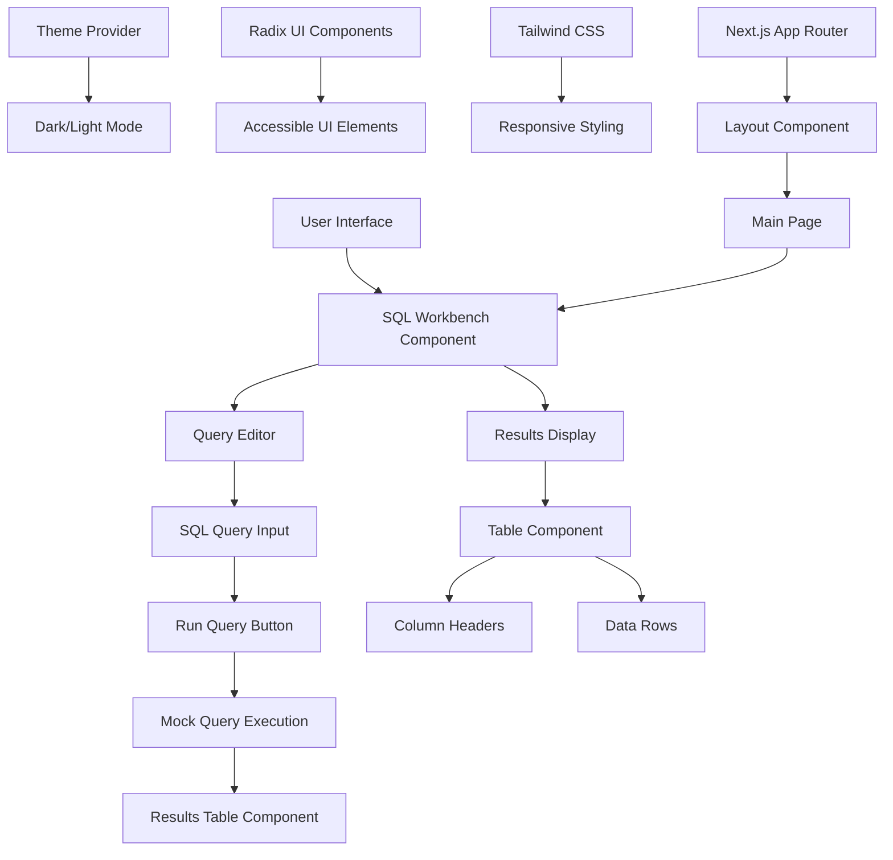

# SQL Client Query Workbench

A modern, responsive SQL query workbench built with Next.js 14 and React. This application provides an intuitive interface for writing and executing SQL queries with mock data.

## 🚀 Features

- **SQL Query Editor**: Write and execute SQL queries with syntax highlighting
- **Results Display**: View query results in a clean, tabular format
- **Responsive Design**: Works seamlessly on desktop and mobile devices
- **Modern UI**: Built with Radix UI components and Tailwind CSS
- **Dark/Light Theme**: Theme switching support
- **Mock Data**: Demo application with sample data for testing

## 📦 Dependencies

### Core Framework
- **Next.js 14.2.16** - React framework for production
- **React 18** - UI library
- **React DOM 18** - React rendering
- **TypeScript 5** - Type safety

### UI Components & Styling
- **@radix-ui/react-*** - Comprehensive UI component library
  - `@radix-ui/react-accordion` (1.2.2)
  - `@radix-ui/react-alert-dialog` (1.1.4)
  - `@radix-ui/react-aspect-ratio` (1.1.1)
  - `@radix-ui/react-avatar` (1.1.2)
  - `@radix-ui/react-checkbox` (1.1.3)
  - `@radix-ui/react-collapsible` (1.1.2)
  - `@radix-ui/react-context-menu` (2.2.4)
  - `@radix-ui/react-dialog` (1.1.4)
  - `@radix-ui/react-dropdown-menu` (2.1.4)
  - `@radix-ui/react-hover-card` (1.1.4)
  - `@radix-ui/react-label` (2.1.1)
  - `@radix-ui/react-menubar` (1.1.4)
  - `@radix-ui/react-navigation-menu` (1.2.3)
  - `@radix-ui/react-popover` (1.1.4)
  - `@radix-ui/react-progress` (1.1.1)
  - `@radix-ui/react-radio-group` (1.2.2)
  - `@radix-ui/react-scroll-area` (1.2.2)
  - `@radix-ui/react-select` (2.1.4)
  - `@radix-ui/react-separator` (1.1.1)
  - `@radix-ui/react-slider` (1.2.2)
  - `@radix-ui/react-slot` (1.1.1)
  - `@radix-ui/react-switch` (1.1.2)
  - `@radix-ui/react-tabs` (1.1.2)
  - `@radix-ui/react-toast` (1.2.4)
  - `@radix-ui/react-toggle` (1.1.1)
  - `@radix-ui/react-toggle-group` (1.1.1)
  - `@radix-ui/react-tooltip` (1.1.6)

- **Tailwind CSS 4.1.9** - Utility-first CSS framework
- **tailwindcss-animate 1.0.7** - Animation utilities
- **tailwind-merge 2.5.5** - Tailwind class merging utility
- **class-variance-authority 0.7.1** - Component variant management
- **clsx 2.1.1** - Conditional className utility

### Icons & Fonts
- **lucide-react 0.454.0** - Icon library

### Data Processing
- **zod 3.25.67** - Schema validation

### Forms & Validation
- **react-hook-form 7.60.0** - Form state management
- **@hookform/resolvers 3.10.0** - Form validation resolvers

### UI Enhancements
- **next-themes 0.4.6** - Theme management
- **sonner 1.7.4** - Toast notifications
- **cmdk 1.0.4** - Command palette
- **vaul 0.9.9** - Drawer component
- **react-resizable-panels 2.1.7** - Resizable panel layouts
- **embla-carousel-react 8.5.1** - Carousel component
- **recharts 2.15.4** - Chart library
- **react-day-picker 9.8.0** - Date picker
- **date-fns 4.1.0** - Date utility library
- **input-otp 1.4.1** - OTP input component

### Analytics & Monitoring
- **@vercel/analytics 1.3.1** - Vercel analytics

### Development Dependencies
- **@types/node 22** - Node.js type definitions
- **@types/react 18** - React type definitions
- **@types/react-dom 18** - React DOM type definitions
- **postcss 8.5** - CSS post-processor
- **@tailwindcss/postcss 4.1.9** - Tailwind CSS PostCSS plugin
- **tw-animate-css 1.3.3** - Tailwind animation utilities
- **autoprefixer 10.4.20** - CSS vendor prefixing

## 🏗️ Application Architecture



## 🚀 Getting Started

### Prerequisites
- Node.js 18+ 
- pnpm, npm, or yarn package manager

### Installation

1. Clone the repository:
```bash
git clone <repository-url>
cd sql-client-workbench
```

2. Install dependencies:
```bash
pnpm install
# or
npm install
# or
yarn install
```

3. Run the development server:
```bash
pnpm dev
# or
npm run dev
# or
yarn dev
```

4. Open [http://localhost:3000](http://localhost:3000) in your browser.

### Build for Production

```bash
pnpm build
pnpm start
```

## 📁 Project Structure

```
sql-client-workbench/
├── app/                    # Next.js app directory
│   ├── globals.css        # Global styles
│   ├── layout.tsx         # Root layout component
│   └── page.tsx           # Main page component
├── components/            # React components
│   ├── ui/               # Reusable UI components
│   ├── results-table.tsx # Query results display
│   ├── sql-workbench.tsx # Main workbench component
│   └── theme-provider.tsx # Theme management
├── hooks/                # Custom React hooks
├── lib/                  # Utility functions
├── public/               # Static assets
└── styles/               # Additional stylesheets
```

## 🎯 Usage

1. **Write SQL Queries**: Use the textarea to write your SQL queries
2. **Execute Queries**: Click the "Run" button to execute queries (returns mock data)
3. **View Results**: Query results are displayed in tabular format
4. **Theme Switching**: Toggle between dark and light themes

## 🔧 Customization

The application is built with a modular component architecture, making it easy to:
- Add new UI components using the existing Radix UI setup
- Extend the query execution logic with real database connections
- Customize the styling using Tailwind CSS classes
- Add new data processing capabilities

## 📄 License

This project is private and created for demonstration purposes.

## 🤝 Contributing

This is a demo application. For production use, consider adding:
- Real database connectivity
- Query history and favorites
- Export functionality
- User authentication
- Query validation and error handling
